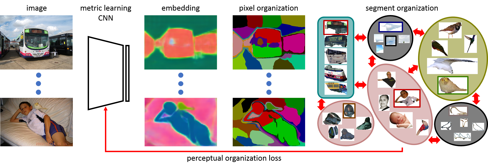

# SegSort: Segmentation by Discriminative Sorting of Segments

By [Jyh-Jing Hwang](https://jyhjinghwang.github.io/), [Stella X. Yu](http://www1.icsi.berkeley.edu/~stellayu/), [Jianbo Shi](https://www.cis.upenn.edu/~jshi/), Maxwell D. Collins, Tien-Ju Yang, Xiao Zhang, and [Liang-Chieh Chen](http://liangchiehchen.com/)



Almost all existing deep learning approaches for semantic segmentation tackle this task as a pixel-wise classification problem.  Yet humans understand a scene not in terms of pixels, but by decomposing it into perceptual groups and structures that are the basic building blocks of recognition.  This motivates us to propose an end-to-end pixel-wise metric learning approach that mimics this process.  In our approach, the optimal visual representation determines the right segmentation within individual images and associates segments with the same semantic classes across images.  The core visual learning problem is therefore to maximize the similarity within segments and minimize  the similarity between segments.  Given a model trained this way, inference is performed consistently by extracting pixel-wise embeddings and clustering, with the semantic label determined by the majority vote of its nearest neighbors from an annotated set.

As a result, we present the SegSort, as a first attempt using deep learning for unsupervised semantic segmentation, achieving 76% performance of its supervised counterpart.  When supervision is available, SegSort shows consistent improvements over conventional approaches based on pixel-wise softmax training.  Additionally, our approach produces more precise boundaries and consistent region predictions.  The proposed SegSort further produces an interpretable result, as each choice of label can be easily understood from the retrieved nearest segments.

SegSort is published in ICCV 2019, see [our paper](https://arxiv.org/abs/1910.06962) for more details.


## Codebase
This release of SegSort is based on our previous published codebase [AAF](https://github.com/twke18/Adaptive_Affinity_Fields) in ECCV 2018.  It is also easy to integrate SegSort modules [network/segsort/](https://github.com/jyhjinghwang/SegSort/tree/master/network/segsort) with the popular codebase [DeepLab](https://github.com/tensorflow/models/tree/master/research/deeplab).

## Prerequisites

1. Linux
2. Python2.7 or Python3 (>=3.5)
3. Cuda 8.0 and Cudnn 6

## Required Python Packages

1. tensorflow 1.X
2. numpy
3. scipy
4. tqdm
5. PIL
6. opencv

## Data Preparation

* [PASCAL VOC 2012](http://host.robots.ox.ac.uk/pascal/VOC/voc2012/)
* Augmented PASCAL VOC training set by [SBD](http://home.bharathh.info/pubs/codes/SBD/download.html).  We process the ground truth masks, which are placed as [SegSort/dataset/voc12/sbd_clsimg.zip](https://github.com/jyhjinghwang/SegSort/blob/master/dataset/voc12/sbd_clsimg.zip).  Please unzip it and put it besides the VOC2012/ folder as sbd/dataset/clsimg/.
* The ground truth semantic segmentation masks are reformatted as grayscale images, or you can download them [here](https://www.dropbox.com/sh/fd2m7s87gk7jeyh/AAC6tN6syhFKmEaDYCwUIgnXa?dl=0).  Please put them under the VOC2012/ folder.
* The oversegmentation masks (from contours) can be produced by combining any contour detectors with gPb-owt-ucm.  We provide the HED-owt-ucm masks [here](https://www.dropbox.com/sh/fd2m7s87gk7jeyh/AAC6tN6syhFKmEaDYCwUIgnXa?dl=0).  Please put them under the VOC2012/ folder.
* Dataset folder structure:

  sbd/
    - dataset/
      - clsimg/
  
  VOC2012/
    - JPEGImages/
    - segcls/
    - hed/

## ImageNet Pre-Trained Models

Download ResNet101.v1 from [Tensorflow-Slim](https://github.com/tensorflow/models/tree/master/research/slim).
Please put it under a new directory SegSort/snapshots/imagenet/trained/.

We also provide our SegSort models (supervised/unsupervised) trained on PASCAL VOC and results [here](https://www.dropbox.com/sh/fd2m7s87gk7jeyh/AAC6tN6syhFKmEaDYCwUIgnXa?dl=0).

## Bashscripts to Get Started

* SegSort (Single-GPU and fast training)
```
source bashscripts/voc12/train_segsort.sh
```

* SegSort (Multi-GPUs)
```
source bashscripts/voc12/train_segsort_mgpu.sh
```

* Unsupervised SegSort (Single-GPU)
```
source bashscripts/voc12/train_segsort_unsup.sh
```

* Baseline Models:  Please refer to our previous codebase [AAF](https://github.com/twke18/Adaptive_Affinity_Fields).


## Citation
If you find this code useful for your research, please consider citing our paper [SegSort: Segmentation by Discriminative Sorting of Segments](https://arxiv.org/abs/1910.06962).

```
@inproceedings{hwang2019segsort,
  title={SegSort: Segmentation by Discriminative Sorting of Segments},
  author={Hwang, Jyh-Jing and Yu, Stella X and Shi, Jianbo and Collins, Maxwell D and Yang, Tien-Ju and Zhang, Xiao and Chen, Liang-Chieh},
  booktitle={Proceedings of the IEEE International Conference on Computer Vision},
  pages={7334--7344},
  year={2019}
}
```

## License
SegSort is released under the MIT License (refer to the LICENSE file for details).
